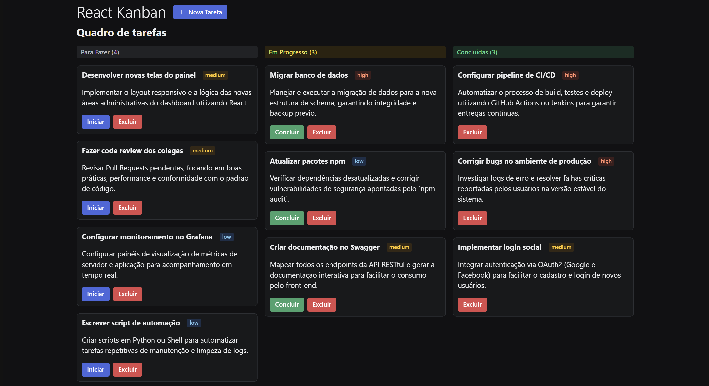

# 🗂️ React Kanban

Aplicação **Kanban** desenvolvida com **React** para gerenciamento de tarefas, permitindo organizar atividades em colunas de status como **Para Fazer**, **Em Progresso** e **Concluídas**.

O projeto simula um cenário real de times de desenvolvimento, com tarefas, prioridades e ações básicas de fluxo de trabalho.



---

## 🚀 Funcionalidades

- 📌 Criação de tarefas
- 🔄 Movimentação entre colunas
- 🏷️ Classificação por prioridade (low, medium, high)
- ▶️ Iniciar tarefas
- ✅ Concluir tarefas
- ❌ Excluir tarefas
- 📊 Contador de tarefas por coluna
- 💻 Interface moderna e responsiva
- 🌙 Tema escuro (Dark Mode)

---

## 🧱 Estrutura do Kanban

O quadro é dividido em três colunas principais:

- **Para Fazer**  
  Tarefas ainda não iniciadas

- **Em Progresso**  
  Tarefas que estão sendo executadas

- **Concluídas**  
  Tarefas finalizadas

Cada tarefa contém:
- Título
- Descrição
- Prioridade
- Ações de controle

---

## 🛠️ Tecnologias Utilizadas

- **React**
- **JavaScript (ES6+)**
- **CSS**
- **React Hooks**
- **Componentização**
- **Estado local**

---

## 📂 Estrutura de Pastas (resumida)

```bash
src/
 ├── components/
 │   ├── Board
 │   ├── Column
 │   └── Card
 ├── styles/
 ├── App.jsx
 └── main.jsx
```

---

## ▶️ Como Executar o Projeto

### 1️⃣ Clonar o repositório
```bash
git clone https://github.com/guilhermeguerradev/projeto-react-kanban.git
```

### 2️⃣ Acessar a pasta do projeto
```bash
cd projeto-react-kanban
```

### 3️⃣ Instalar as dependências
```bash
npm install
```

### 4️⃣ Rodar o projeto
```bash
npm run json-server
npm run dev
```

O projeto estará disponível em:
```
http://localhost:5173
```

---

## 🎯 Objetivo do Projeto

Este projeto foi desenvolvido com fins de **aprendizado e portfólio**, focando em:

- Lógica de estado no React
- Componentização
- Boas práticas de organização
- Simulação de um fluxo real de tarefas de desenvolvimento

---

## 📌 Melhorias Futuras

- Drag and Drop
- Persistência com LocalStorage ou API
- Autenticação de usuários
- Filtros por prioridade
- Edição de tarefas
- Integração com backend

---

## 👨‍💻 Autor

**Guilherme Guerra**  
Estudante de Engenharia de Software  

🔗 GitHub: https://github.com/guilhermeguerradev

---

## 📄 Licença

Este projeto está sob a licença MIT.
